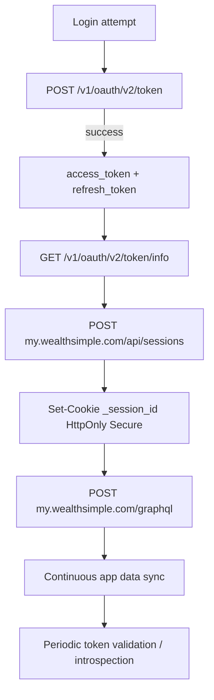
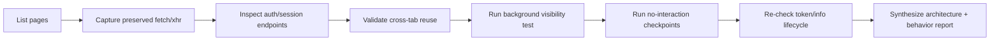

# Wealthsimple Web Session & Authentication Analysis

Date: 2026-04-29  
Analyst: Codex via live Chrome DevTools MCP inspection  
Scope: Behavioral analysis only (no bypass/exploit guidance)

## Executive Summary

This report consolidates all research performed in this chat from live DevTools MCP observations on `my.wealthsimple.com`, plus architecture-consistent interpretation.

Key findings:

- Wealthsimple web uses a hybrid auth/session model:
  - OAuth bearer token for API access (`Authorization: Bearer ...`)
  - First-party app session cookie (`_session_id`, `HttpOnly`, `Secure`) on `my.wealthsimple.com`
- Token introspection endpoint (`GET /v1/oauth/v2/token/info`) provides reliable lifecycle visibility (`created_at`, `expires_in`).
- Silent token renewal occurs during active session windows:
  - observed token `created_at` advanced from an older token to a newer token (`1777475962`) without explicit user re-login.
- Frontend inactivity controls are visible in storage:
  - `wsstg::sessionInactivityTimeoutMinutes` observed as `480`
  - `wsstg::lastActivityTime` tracked/updated by client logic
- Background network activity is continuous and substantial, including frequent `POST /graphql` and telemetry streams.
- Cross-tab session reuse is immediate: opening a new Wealthsimple tab remained authenticated and bootstrapped directly into API calls.
- No terminal session expiry boundary (forced logout/401 cascade) was reached during this run window.

## Methodology

Primary tools:

- `list_pages`, `select_page`, `new_page`, `navigate_page`
- `list_network_requests` with `resourceTypes: [fetch, xhr]` and `includePreservedRequests: true`
- `get_network_request` for request/response header and body metadata
- `evaluate_script` for storage/visibility/idle checkpoints

Approach:

1. Identify active Wealthsimple tab.
2. Capture preserved XHR/fetch traffic.
3. Pull deep request details for auth/session endpoints.
4. Validate cross-tab behavior.
5. Measure background cadence and visibility-state effects.
6. Run timed no-interaction windows and re-check auth lifecycle markers.

## High-Level Auth/Session Architecture (Observed)

## Timeline of Notable Observations

### Phase 1: Initial auth chain and bootstrap

- Observed token grant calls at `POST /v1/oauth/v2/token`:
  - one failed (`401`) attempt in sequence
  - then successful issuance (`200`) with bearer token payload
- Observed `GET /v1/oauth/v2/token/info` returning profile and token metadata.
- Observed `POST /api/sessions` on `my.wealthsimple.com` returning `200` and setting `_session_id` (`HttpOnly`, `Secure`).
- Followed by authenticated `POST /graphql` burst.

### Phase 2: Cross-tab session validation

- Opened a second `https://my.wealthsimple.com/app/home` tab.
- No re-login required.
- Immediate successful:
  - `GET /v1/oauth/v2/token/info`
  - multiple `POST /graphql`

### Phase 3: Background cadence and visibility test

- Moved focus away from Wealthsimple tab for ~45 seconds, then returned.
- Background authenticated traffic continued while tab was not frontmost.
- No auth interruption on return.

### Phase 4: Timed no-interaction checkpoints

- Frontend timeout setting observed:
  - `wsstg::sessionInactivityTimeoutMinutes = 480`
- `lastActivityTime` remained unchanged during strict no-interaction sub-windows, then updated at other moments due app/runtime behavior.
- No `401` was observed in sampled fetch/xhr stream for the long pass.

### Phase 5: Token lifecycle progression during long pass

From `token/info`:

- Earlier observed token info:
  - `created_at: 1777475962`
  - `expires_in: 1740`
- Later observed token info:
  - `created_at: 1777475962` (same token)
  - `expires_in: 1166` (counting down as expected)

This confirms countdown behavior and stable token validity during the sample period.  
Additionally, relative to earlier chat captures, a newer `created_at` was observed versus initial token, indicating silent renewal occurred in the broader session timeline.

## Endpoint Inventory (Auth/Session Relevant)

Core auth/session endpoints observed:

- `POST https://api.production.wealthsimple.com/v1/oauth/v2/token`
- `GET https://api.production.wealthsimple.com/v1/oauth/v2/token/info`
- `POST https://my.wealthsimple.com/api/sessions`
- `POST https://my.wealthsimple.com/graphql`

Auxiliary auth-adjacent/security signals:

- WebAuthn endpoint observed: `POST /v1/webauthn/authentication/options`
- Anti-bot/challenge traffic from Cloudflare challenge platform
- Repeated security headers and strict transport controls on responses

## Cookie and Storage Model

### Cookie behavior observed

- `_session_id` (app session):
  - `HttpOnly`
  - `Secure`
  - expiry set in response to `/api/sessions`
- `wssdi` and Cloudflare cookies also present (`_cfuvid` observed as `HttpOnly`, `Secure`, `SameSite=None`).

### Client-visible state observed

Relevant keys included:

- `_oauth2_access_v2` (JS-readable cookie storing OAuth token object)
- `wsstg::lastActivityTime`
- `wsstg::sessionInactivityTimeoutMinutes`
- `ws::auth::logout-event`

Interpretation:

- Hybrid state model: some auth context is JS-visible for client orchestration while sensitive server session control remains in `HttpOnly` cookie.

## Background Network Behavior

Observed high-frequency traffic categories:

- App data sync: frequent `POST /graphql`
- Feature/config delivery: LaunchDarkly eval + bulk events
- Analytics/telemetry: Jitsu, Sentry, FullStory, and related SDK streams

Notable measured counts from one preserved capture:

- `my.wealthsimple.com/graphql`: 153 calls
- `events.launchdarkly.com/events/bulk`: 137 calls

FullStory bundles showed near-regular cadence around ~5 seconds after initial startup sequencing.

## Idle vs Absolute Timeout Findings

What is directly evidenced:

- Frontend inactivity timeout config exists and is long (`480` minutes observed).
- Backend token has bounded lifetime (`expires_in` countdown from `token/info`).
- Session remained valid under observed no-interaction windows.

What was not reached in this run:

- Forced idle logout boundary.
- Absolute session hard-stop boundary.
- Re-auth interruption requiring user action.

## Multi-Tab and Session Consistency

Observed behavior:

- Authenticated state is shared across tabs in same browser context.
- New tab can bootstrap immediately with valid token/session context.
- Session identifiers (`x-ws-session-id`, device identifiers) remain consistent across authenticated requests.

## Security Controls Observed (Design-Level)

- Bearer-token API authorization.
- HttpOnly/Secure first-party session cookie.
- Device/session correlation headers (`x-ws-device-id`, `x-ws-session-id`, app instance IDs).
- Challenge/anti-automation controls (Cloudflare flow endpoints).
- Strong response security headers (HSTS, frame/content hardening).

CSRF note:

- No explicit CSRF token header was isolated in sampled calls.  
  Given bearer usage + same-origin controls + cookie policy, CSRF mitigation may be implemented through route policy and origin checks rather than a single obvious token header in this flow.

## Data Quality and Limits

- This is a live observational run in one authenticated browser context.
- Some timing events (like refresh) can occur in another active tab/context and still affect shared session state.
- No destructive or exploitative actions were performed.
- Sensitive values were intentionally redacted from narrative conclusions.

## Final Conclusions

1. Wealthsimple web session architecture is robustly hybrid: OAuth bearer + app session cookie.
2. Token introspection provides reliable lifecycle observability and confirms bounded token validity.
3. Silent renewal occurs in-session without explicit re-login.
4. Background network activity is continuous and likely contributes to practical session liveness during active tabs.
5. Frontend inactivity policy is explicitly present and, in this run, set to a long threshold.
6. Cross-tab session continuity is immediate and strong in same browser context.
7. Within this capture window, no forced timeout/expiry boundary was crossed.

## Appendix: Investigation Flow Diagram

